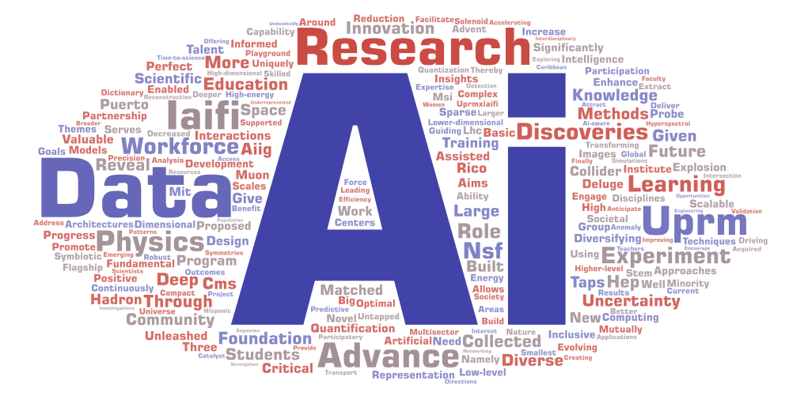

<div style="text-align: center">
# Bienvenidos al taller de Machine Learning!
</div>

```{figure} content/figures/ML_logo.png
:width: 100%
:align: center
```

_Este taller ofrece una introducción a los principios de Machine Learning. El material ha sido desarrollado por:_

<div style="text-align: center; font-size: 1.2em">
Iliomar Rodriguez Ramos y Juvenal Bassa
</div>

<div style="text-align: center; margin-top: 1.5em; display: flex; justify-content: center; align-items: center; gap: 3em;">
  
  
</div>
